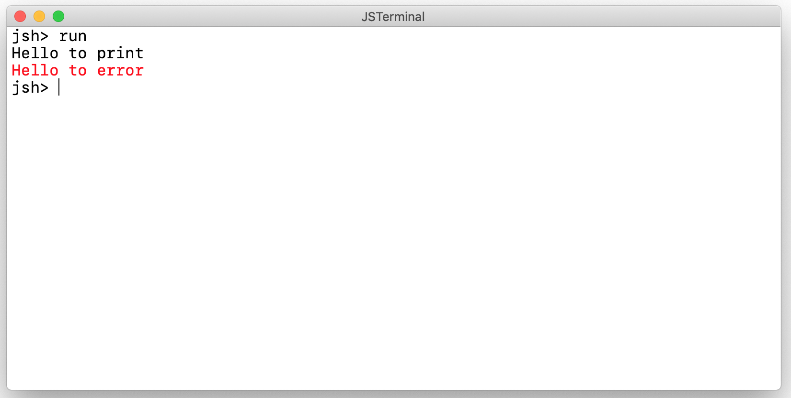
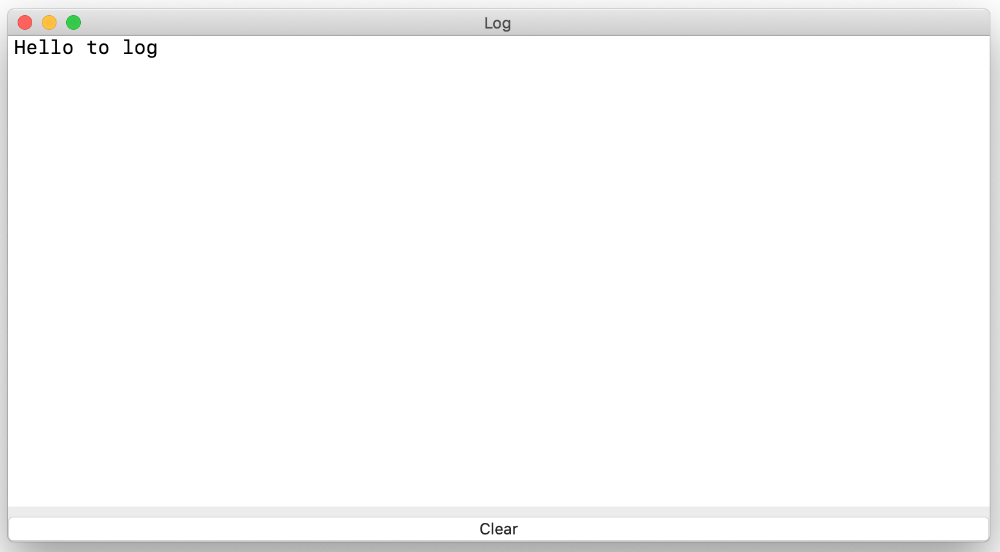

# Debug

## Log message
### `console.log` method
You can use the log output. It is printed by `console.log(..)`  and put into the individual log window.

The `console` object is used to output the log. These are method of it:

|Method         |Output to      |File           |
|:--            |:--            |:--            |
|`print`        |terminal       |stdout         |
|`error`        |terminal       |stderr         |
|`log`          |log window     |*none*         |

### Example
This is a sample script to see the output messages.
````
console.print("Hello to print\n") ;
console.error("Hello to error\n") ;
console.log("Hello to log\n") ;
````




# References
* [User's manual](https://github.com/steelwheels/JSTerminal/blob/master/Documents/UsersManual.md): The main document for the user. This document is refered by it.

