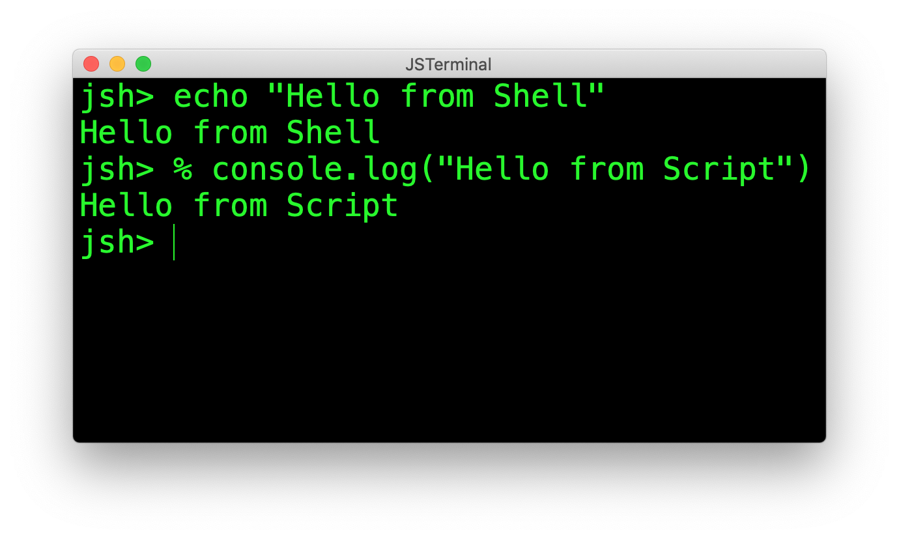
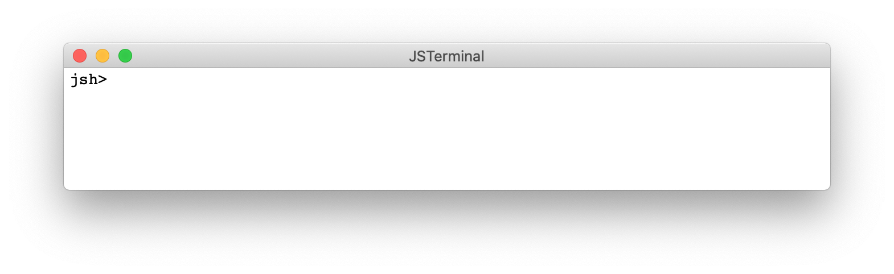
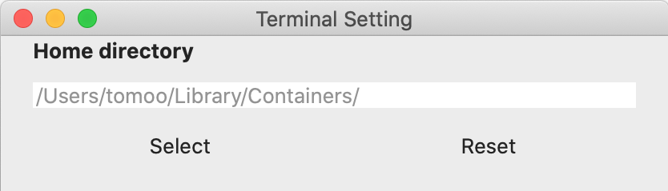
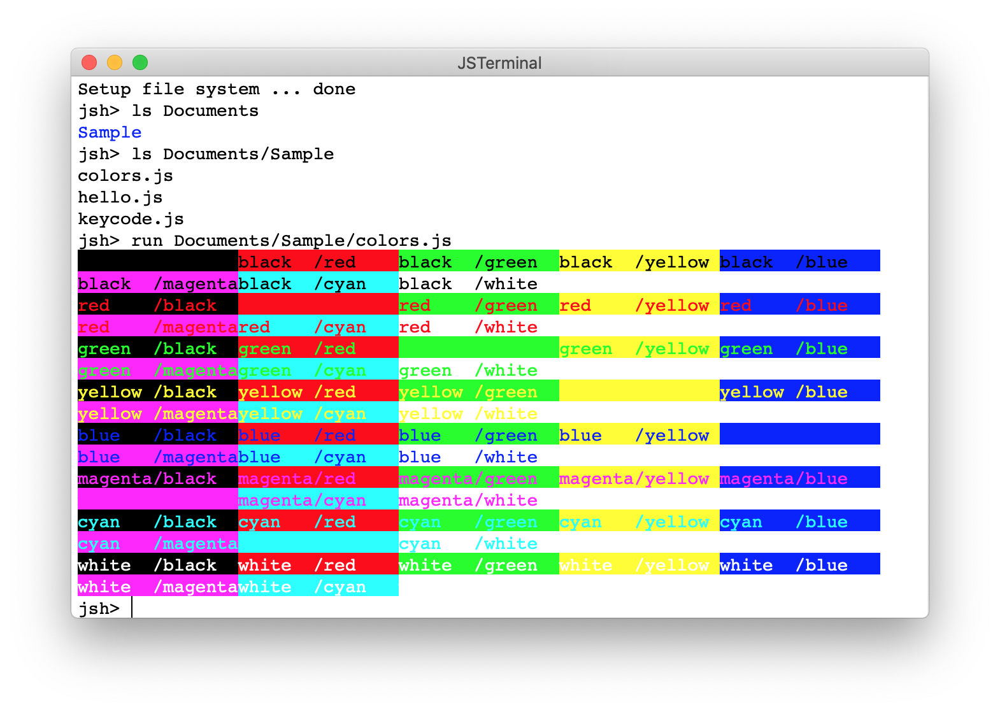

# JSTerminal: Terminal application for JavaScript shell

## Introduction
The *JSTerminal* is a terminal application to execute JavaScript shell.
The JavaScript shell (named *jsh*) is extended JavaScript to make shell scripting easier. See [jsh language manual](https://github.com/steelwheels/JSTools/blob/master/Document/jsh-lang.md) and [jsh system manual](https://github.com/steelwheels/JSTools/blob/master/Document/jsh-sys.md) for more details.

This application is open source software.
If you have any question or suggestions please send e-mail to [Steel Wheels Project](mailto:steel.wheels.project@gmail.com) or write issue to the [Github repository](https://github.com/steelwheels/JSTerminal).

This is a sample screen short of this application.


In the following section, this document describes:
* [Licence](#License): The license information
* [How to use](#How): Step by step examination of the introduction to use this software
* [Programming](#Programming): Documents for programming
* [Bug and restrictions](#Bug): Known problems
* [Related documents](#Related): Links for references

## License
Copyright (C) 2020 [Steel Wheels Project](https://github.com/steelwheels).
This software is distributed under [GNU GENERAL PUBLIC LICENSE Version 2](https://www.gnu.org/licenses/old-licenses/gpl-2.0.html) and the document is distributed under [GNU Free Documentation License](https://www.gnu.org/licenses/fdl-1.3.en.html).

## Download
You can download this software from App Store.
[This page](https://apps.apple.com/jp/app/jsterminal/id1511276015?mt=12) links to the page to download this application.
On the otherwise, please search by keyword "JSTerminal" on the .

## How to use
### Boot
Double click the icon of JSTerminal or execute following command at the `Terminal.app`.
````
open -a /Applications/JSTerminal.app
````
You will see the following window:


The word `jsh>` is called prompt. It encourage the input from the user.
Type `ls Documents` on the window. You will see the contents of `documents` folder:
````
jsh> ls Documents
iChats
jsh>
````

### Set home directory
The *JSTerminal* is sandbox application to protect user from hacking.
This application allows to access __under home directory only__.
You can define home directory at the [Preference Window](#Preference).

The changing home directory means that you allow this application accesses your files. If you don't like it, do not change the home directory (See [Privacy Policy](https://github.com/steelwheels/JSTerminal/blob/master/Documents/PrivacyPolicy.txt)).

You can use this application without changing home directory.
But if you want to change your home directory, change the `Home directory` section by clicking `select` button:


The setting will be activated for the next new window.
Please select `New` menu item from the `File` menu.

### Setup
To install some scripts into the home directory, execute the [setup command](https://github.com/steelwheels/JSTools/blob/master/Document/builtins/setup-man.md). This command initialize the file system under home directory.
````
jsh> pwd
/Users/tomoo/Development/Shell
jsh> setup
Make directory: /Users/tomoo/Development/Shell/Documents
Make directory: /Users/tomoo/Development/Shell/Library
Copy from /Applications/JSTerminal.app/Contents/Resources/Documents/Sample to /Users/tomoo/Development/Shell/Documents/Sample
Setup file system ... done
jsh> ls Documents
Sample
jsh> ls Documents/Sample
colors.js
hello.js
keycode.js
jsh>
````

### Execute shell command
The prompt `'>'` means *shell mode* .
The shell mode accepts shell commands such as `ls` command.
````
jsh> echo "Hello, world"
Hello, world
````
You can execute the JavaScript by prepending `%` at the head of the statement.
````
jsh> % console.log("Hello, world") ;
Hello, world
````
You can switch the *shell mode* into *JavaScript mode* by entering `%` key. The JavaScript mode accepts JavaScript code dynamically.
````
jsh> %
jsh% let a = 10 ;
jsh% console.log("a = " + a) ;
a = 10
jsh%
````
You can switch to shell mode by entering `>` key.
````
jsh% >
jsh> ls
Documents
jsh>
````

### Execute sample script
You can use [run command](https://github.com/steelwheels/JSTools/blob/master/Document/builtins/run-man.md) to execute the script (Both JavaScript and Shell scripts are supported).
You can also execute the script by [open menu](https://github.com/steelwheels/JSTerminal/blob/master/Documents/DesktopMenu.md).

This is famous demo program for `jsh`.
````
jsh> run Documents/Sample/hello.js
Hello, world !!
````
And this is sample program to test terminal color.
````
run Documents/Sample/colors.js
````
And you will get following outputs:


When the run command is executed without script path, the dialog is used to select the file.
For more details, see [run command](https://github.com/steelwheels/JSTools/blob/master/Document/builtins/run-man.md).

### Execute macOS application
You can launch the macOS application by the command line.

1. Launch by shell command:
````
 jsh> open -a /System/Application/TextEdit.app
````
2. Lanchy by JavaScript function 
````
 jsh% launch("/System/Application/TextEdit.app", null) :
````

About launch function, see [launch function](https://github.com/steelwheels/KiwiScript/blob/master/KiwiLibrary/Document/Function/Launch.md) in [KiwiLibrary](https://github.com/steelwheels/KiwiScript/tree/master/KiwiLibrary).

### File package
The bundle of the files are used for scripting. It is called _JavaScript Package_ . You can implement JavaScript program by multiple script files.
For more details, see [JavaScript Package](https://github.com/steelwheels/JSTools/blob/master/Document/jspkg.md).
This is sample implementation of `manifest.json` file which presents the bundled files for an application script:
````
{
	application:	"main.js",
	libraries: [
		"lib_a.js",
		"lib_b.js"
	],
	threads: {
		"thread_a": "thread_a.js",
		"thread_b": "thread_b.js"
	}
}
````
The format of `manifest.json` is defined in [extended JavaScript Object Notation](https://github.com/steelwheels/KiwiScript/blob/master/KiwiLibrary/Document/Data/object-notation.md).

### `.jshrc` file
If you put .jshrc JavScript file on your home directory, the file is parsed at the boot time (before outputting 1st prompt).

This is a samle context of `.jshrc` file. You can get the version of shell and change the prompt on the shell by referencing/updating [Preference Object](https://github.com/steelwheels/KiwiScript/blob/master/KiwiLibrary/Document/Class/Preference.md).

````
/* Print version */
console.log("jsh: version: " + Preference.system.version) ;

/* Set prompt */
Preference.shell.prompt = function() {
        let orgcol = Preference.terminal.foregroundColor ;
        let orgesc = EscapeCode.color(1, orgcol) ;
        let newcol = Color.blue ;
        let newesc = EscapeCode.color(1, newcol) ;
        return newesc + "jsh" + orgesc ;
} ;
````

### Cocoa Scripting
This application supports [Cocoa Scripting](https://developer.apple.com/library/archive/documentation/Cocoa/Conceptual/ScriptableCocoaApplications/SApps_intro/SAppsIntro.html#//apple_ref/doc/uid/TP40001982-BCICHGIE). This is sample script to control this application. For more precise, see [Cocoa Scripting Support](https://github.com/steelwheels/Coconut/blob/master/CoconutScript/Document/cocoa-scripting-support.md).
````
tell application "JSTerminal"
  set foreground color to green
  set background color to black
end tell
````

## How to program
### Programming
Please read [jsh language manual](https://github.com/steelwheels/JSTools/blob/master/Document/jsh-lang.md) to know how to describe the shell script by JavaScript.

### Details
For more details (except shell script function), See the following documents.
* [Desktop menu](https://github.com/steelwheels/JSTerminal/blob/master/Documents/DesktopMenu.md): The specification of the desktop menu

## Bug and Restrictions
See [Bug & Restrictions](https://github.com/steelwheels/JSTerminal/blob/master/Documents/Restrictions.md).

## Release history
|Version        |Date		|Description            |
|:--            |:--		|:--                    |
|1.0   	|2020/05/05	|Initial Version        |
|1.1	|2020/05/28	|Update to support [Curses Class](https://github.com/steelwheels/KiwiScript/blob/master/KiwiLibrary/Document/Class/Curses.md). |
|1.2	|2020/06/28	|Support [JavaScript Package](https://github.com/steelwheels/JSTools/blob/master/Document/jspkg.md), Support command and file name completion by TAB key. |
|1.3	|2020/07/13 |Support `.jshrc` file to setup environment at the boot time. Fix bugs about terminal emulation. |
|1.4	|Not released yet |Support Cocoa Scripting to be controlled by AppleScript. |

## Related document
* [README.md](https://github.com/steelwheels/JSTerminal): Top level document of this application.
* [Kiwi Standard Library](https://github.com/steelwheels/KiwiScript/blob/master/KiwiLibrary/Document/Library.md): The JSTerminal support this.
* [Steel Wheels Project](http://steelwheels.github.io): Developer's web site.
