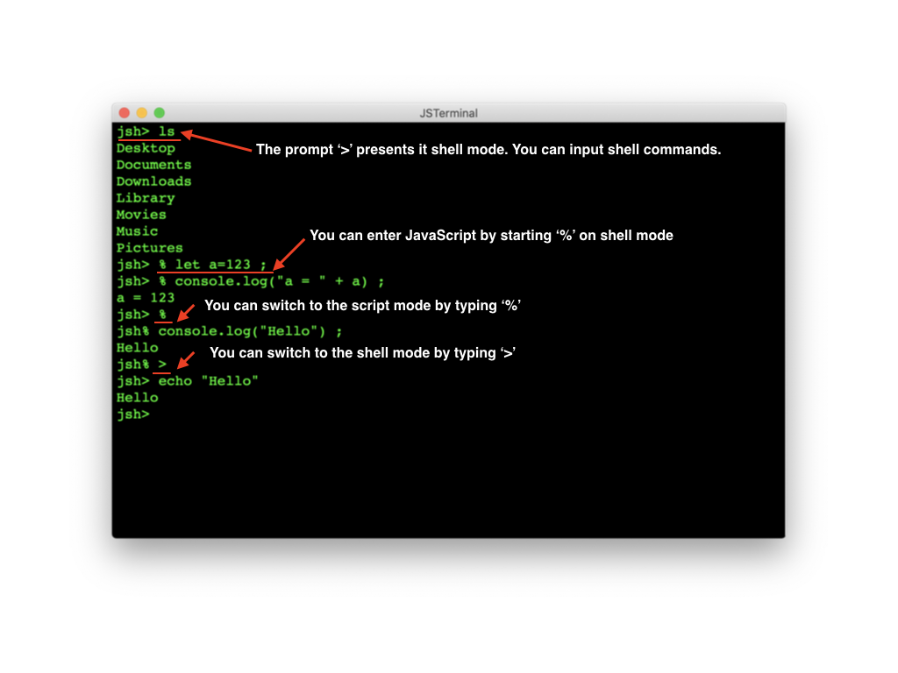

# JSTerminal: Terminal application for JavaScript shell

## Introduction
The *JSTerminal* is a terminal application to execute JavaScript shell.
The JavaScript shell (named *jsh*) is extended JavaScript to make shell scripting easier. See [jsh language manual](https://github.com/steelwheels/JSTools/blob/master/Document/jsh-lang.md) for more details.

This is a sample screen short of this application.


You can see some sample scripts at [sample scripts](https://github.com/steelwheels/JSTools/blob/master/Document/samples/sample.md).

## Setup
The *JSTerminal* is sandbox application to protect user from hacking.
This application allows to access __under home directory only__.
You can define home directory at the [Preference Window](#Preference).

## How to use
### Terminal
There are input mode on terminal.
The prompt `'>'` means *shell mode* and `'%'` is *script mode*.
The shell mode accepts shell commands such as `ls` command.
And the script mode accepts JavaScript code.
You can switch these mode by `'>'` and `'%'`.



### JavaScript shell (aka jsh)
You have to know about JavaScript and [JavaScript Shell (aka jsh)](https://github.com/steelwheels/JSTools/blob/master/Document/jsh-lang.md).
See [language manual](https://github.com/steelwheels/JSTools/blob/master/Document/jsh-lang.md). And there are some sample programs. See [sample scripts](https://github.com/steelwheels/JSTools/blob/master/Document/samples/sample.md).

The *jsh* supports custom JavaScript library named [Kiwi Standard Library](https://github.com/steelwheels/KiwiScript/blob/master/KiwiLibrary/Document/Library.md).

## Execute the script file on JSTerminal
### Run command
You can use *run* command to execute script on the JavaScript Shell.
````
jsh> run /Users/steel_wheels/Develop/hello.js
Hello, world !!
````

When the run command is executed without script path, the dialog is used to select the file.
For more details, see [run command](https://github.com/steelwheels/JSTools/blob/master/Document/builtins/run-man.md).

### "Open" menu
You can select the script file by "open" menu.
The opened script is executed on the new terminal window.

## Menu
This section describes about functions of desktop menu items.
### File Menu
1. ___New___: Open the new window and execute *jsh* on it.
2. ___Open___: Select script file and open the new window to execute it.
3. ___Open Recent___: Select script files from the list of files that you opened.
4. ___Close___: Close the current window
5. Save
6. Duplicate
7. Rename
8. Move to

### Edit Menu

## Preference window
You can change the terminal attributes by preference window.


### Home directory
Set the home directory for you. Each users can have user's own directory.
### Size
Define the number of columns and rows in the terminal.
### Font
Define the kind of the font and it's size for the terminal.
### Color
Define the foreground and background color of the terminal.

# Bug and Restrictions
See [Bug & Restrictions](https://github.com/steelwheels/JSTerminal/blob/master/Documents/restrictions.md).

# Related document
* [README.md](https://github.com/steelwheels/JSTerminal): Top level document of this application.
* [Kiwi Standard Library](https://github.com/steelwheels/KiwiScript/blob/master/KiwiLibrary/Document/Library.md): The JSTerminal support this.
* [Steel Wheels Project](http://steelwheels.github.io): Web site of developer.
