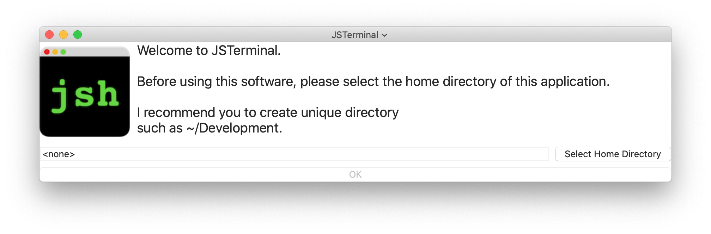
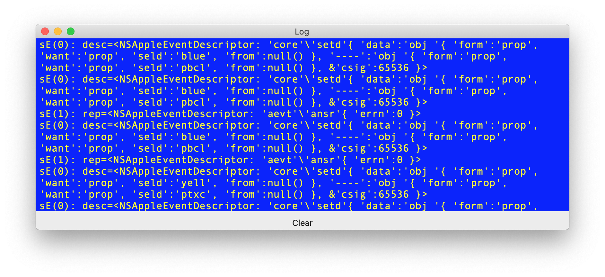

# JSTerminal: Terminal application for JavaScript shell

## Introduction
The *JSTerminal* is a terminal application.
This application has following features:
* _JavaScriptable_: You can write shell script by JavaScript.　The JavaScript shell (named *jsh*) is supported. It extend JavaScript to make shell scripting easier. See [jsh language manual](https://github.com/steelwheels/JSTools/blob/master/Document/jsh-lang.md) and [jsh system manual](https://github.com/steelwheels/JSTools/blob/master/Document/jsh-sys.md) for more details.
* _GUI Designable_:  You can implement GUI by component based language named [Amber Programming Language](https://github.com/steelwheels/Amber/blob/master/Document/amber-language.md). You can call the script from JavaScript code to display the graphical user interface.

This product is open source software.
If you have any question or suggestions please send e-mail to [Steel Wheels Project](mailto:steel.wheels.project@gmail.com) or write issue to the [Github repository](https://github.com/steelwheels/JSTerminal).

This is a sample screen short of this application.


This is a sample GUI which is implemented on this application.


In the following section, this document describes:
* [Licence](#License): The license information
* [How to use](#How): Step by step examination of the introduction to use this software
* [Programming](#Programming): Documents for programming
* [GUI](#GUI): GUI programming
* [Debugging](#Debugging): How to debug on this terminal.
* [Misc](#Misc): Miscellaneous information such as desktop menu
* [Bug and restrictions](#Bug): Known problems
* [Related documents](#Related): Links for references

## License
Copyright (C) 2020 [Steel Wheels Project](https://github.com/steelwheels).
This software is distributed under [GNU GENERAL PUBLIC LICENSE Version 2](https://www.gnu.org/licenses/old-licenses/gpl-2.0.html) and the document is distributed under [GNU Free Documentation License](https://www.gnu.org/licenses/fdl-1.3.en.html).

## Download
You can download this software from App Store.
[This page](https://apps.apple.com/jp/app/jsterminal/id1511276015?mt=12) links to the page to download this application.
On the otherwise, please search by keyword "JSTerminal" on the .

## How to use
### Boot
Double click the icon of JSTerminal or execute following command at the `Terminal.app`.
````
open -a /Applications/JSTerminal.app
````

### Setup
At the first boot, the following window will be appeared.
This window is used to select _home directory_ of this application.
The *JSTerminal* is [sandboxed application](https://developer.apple.com/documentation/security/app_sandbox).
You must select the directory where the application can access it.

1. Push "Select Home Directory" button and select home directory
2. Press "OK" button to finialize the selection



After pressing the "OK" button, you will see the following window:


The word `jsh>` is called prompt. It encourage the input from the user.
Type `ls` on the window. You will see the contents of current directory:
````
jsh> ls
Game
Sample
````

### Set home directory (again)
You can re-define home directory at the [Preference Window](#Preference).

The changing home directory means that you allow this application accesses your files. If you don't like it, do not change the home directory (See [Privacy Policy](https://github.com/steelwheels/JSTerminal/blob/master/Documents/PrivacyPolicy.txt)).

The default home directory is your top home directory.
You can change the `Home directory` section by clicking `select` button:


### Execute shell command
The prompt `'>'` means *shell mode* .
The shell mode accepts shell commands such as `echo` command.
````
jsh> echo "Hello, world"
Hello, world
````
You can execute the JavaScript by prepending `%` at the head of the statement.
````
jsh> % console.log("Hello, world") ;
Hello, world
````
You can switch the *shell mode* into *JavaScript mode* by entering `%` key. The JavaScript mode accepts JavaScript code dynamically.
````
jsh> %
jsh% let a = 10 ;
jsh% console.log("a = " + a) ;
a = 10
jsh%
````
You can switch to shell mode by entering `>` key.
````
jsh% >
jsh> ls
Documents
jsh>
````

### Execute sample script
You can use [run command](https://github.com/steelwheels/JSTools/blob/master/Document/builtins/run-man.md) to execute the script (Both JavaScript and Shell scripts are supported).

This is famous demo program for `jsh`.
````
jsh> run Sample/hello.js
Hello, world !!
````
And this is sample program to test terminal color.
````
run Sample/colors.js
````
And you will get following outputs:


When the run command is executed without script path, the dialog is used to select the file.
For more details, see [run command](https://github.com/steelwheels/JSTools/blob/master/Document/builtins/run-man.md).
You can find the sample JavaScript programs in [sample game scripts](Games.md).

### File package
The bundle of the files are used for scripting. It is called _JavaScript Package_ . You can implement JavaScript program by multiple script files.
For more details, see [JavaScript Package](https://github.com/steelwheels/JSTools/blob/master/Document/jspkg.md).
This is sample implementation of `manifest.json` file which presents the bundled files for an application script:
````
{
	application:	"main.js",
	libraries: [
		"lib_a.js",
		"lib_b.js"
	],
	threads: {
		"thread_a": "thread_a.js",
		"thread_b": "thread_b.js"
	}
}
````
The format of `manifest.json` is defined in [extended JavaScript Object Notation](https://github.com/steelwheels/KiwiScript/blob/master/KiwiLibrary/Document/Data/object-notation.md).

### `.jshrc` file
If you put .jshrc JavScript file on your home directory, the file is parsed at the boot time (before outputting 1st prompt).

This is a samle context of `.jshrc` file. You can get the version of shell and change the prompt on the shell by referencing/updating [Preference Object](https://github.com/steelwheels/KiwiScript/blob/master/KiwiLibrary/Document/Class/Preference.md).

````
/* Print version */
console.log("jsh: version: " + Preference.system.version) ;

/* Set prompt */
Preference.shell.prompt = function() {
        let orgcol = Preference.terminal.foregroundColor ;
        let orgesc = EscapeCode.color(1, orgcol) ;
        let newcol = Color.blue ;
        let newesc = EscapeCode.color(1, newcol) ;
        return newesc + "jsh" + orgesc ;
} ;
````

### Control by AppleScript
This application supports [Cocoa Scripting](https://developer.apple.com/library/archive/documentation/Cocoa/Conceptual/ScriptableCocoaApplications/SApps_intro/SAppsIntro.html#//apple_ref/doc/uid/TP40001982-BCICHGIE). This is sample script to control this application. For more precise, see [Cocoa Scripting Support](https://github.com/steelwheels/Coconut/blob/master/CoconutScript/Document/cocoa-scripting-support.md).
````
tell application "JSTerminal"
  set foreground color to green
  set background color to black
end tell
````
There are more sample scripts in [sample AppleScript scripts](AppleScript.md).

### Control the other specific applications
This application supports sending AppleEvents to control specific applications: [TextEdit](AppleEvent/TextEdit.md).
This is sample code to control TextEdit application.
You can launch, activate and make new document TextEdit.app.
````
function main(args)
{
    let textedit = launch("/System/Applications/TextEdit.app") ;
    if(textedit.activate()){
    	if(textedit.makeNewDocument()) {
			console.print("New document on TextEdit.app\n") ;
    	}
    }
    return 0 ;
}
````

## Programming
Please read [jsh language manual](https://github.com/steelwheels/JSTools/blob/master/Document/jsh-lang.md) to know how to describe the shell script by JavaScript.

## GUI
You can implement GUI by [Amber Programming Language](https://github.com/steelwheels/Amber/blob/master/Document/amber-language.md).
To learn about the language, see the [programming examples](https://github.com/steelwheels/Amber/blob/master/Document/amber-example.md).

Here is the sample script written by Amber Programming Language.
````
top: VBox {
    ok_button: Button {
        title:  String "OK"
        pressed: Event() %{
        	onsole.log("pressed: OK") ;
            leaveView(1) ;
        %}
    }
    cancel_button: Button {
        title:  String "Cancel"
        pressed: Event() %{
            console.log("pressed: Cancel") ;
            leaveView(0) ;
        %}
    }
}
````
Two buttons are defined in the script. When the "OK" button is pressed, the result of this script is "1". On the otherwise, when the "Cancel" button is pressed, the result value is "0".

The next GUI will be generated by the above script:


## Debugging
### Log Window

The log window is used to output debug log of this application.
The window is shown the the [Log level](https://github.com/steelwheels/KiwiScript/blob/master/KiwiLibrary/Document/Enum/LogLevel.md) is higher than `nolog`. You can change the log level at [preference window](https://github.com/steelwheels/JSTerminal/blob/master/Documents/Preference.md) or [Preference variable](https://github.com/steelwheels/KiwiScript/blob/master/KiwiLibrary/Document/Class/Preference.md).

## Misc
For more details (except shell script function), See the following documents.
* [Desktop menu](https://github.com/steelwheels/JSTerminal/blob/master/Documents/DesktopMenu.md): The specification of the desktop menu

## Bug and Restrictions
See [Bug & Restrictions](https://github.com/steelwheels/JSTerminal/blob/master/Documents/Restrictions.md).

## Release history
|Version        |Date		|Description            |
|:--            |:--		|:--                    |
|1.0   	|2020/05/05	|Initial Version        |
|1.1	|2020/05/28	|Update to support [Curses Class](https://github.com/steelwheels/KiwiScript/blob/master/KiwiLibrary/Document/Class/Curses.md). |
|1.2	|2020/06/28	|Support [JavaScript Package](https://github.com/steelwheels/JSTools/blob/master/Document/jspkg.md), Support command and file name completion by TAB key. |
|1.3	|2020/07/13 |Support `.jshrc` file to setup environment at the boot time. Fix bugs about terminal emulation. |
|1.4	|2020/08/29 |Support AppleEvents to be controlled by AppleScript |
|1.5.4	|2021/01/03 |Support [Amber Programming Language](https://github.com/steelwheels/Amber/blob/master/Document/amber-language.md) for GUI design |

## Related document
* [README.md](https://github.com/steelwheels/JSTerminal): Top level document of this application.
* [Amber Programming Language](https://github.com/steelwheels/Amber/blob/master/Document/amber-language.md): The specification of this language. See [sample scripts](AmberProgramming.md).
* Sample Scripts: [sample game script](Games.md)
* [Kiwi Standard Library](https://github.com/steelwheels/KiwiScript/blob/master/KiwiLibrary/Document/Library.md): The JSTerminal support this.
* [Steel Wheels Project](http://steelwheels.github.io): Developer's web site.
