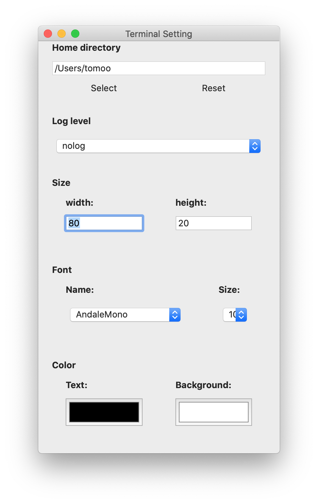

# JSTerminal: Terminal application for JavaScript shell

## Introduction
The *JSTerminal* is a terminal application to execute JavaScript shell.
The JavaScript shell (named *jsh*) is extended JavaScript to make shell scripting easier. See [jsh language manual](https://github.com/steelwheels/JSTools/blob/master/Document/jsh-lang.md) for more details.

This is a sample screen short of this application.

You can see some sample scripts at [sample scripts](https://github.com/steelwheels/JSTools/blob/master/Document/samples/sample.md).

## Menu
This section describes about functions of desktop menu items.
### File Menu
1. ___New___: Open the new window and execute *jsh* on it.
2. ___Open___: Select script file and open the new window to execute it.
3. ___Open Recent___: Select script files from the list of files that you opened.
4. ___Close___: Close the current window
5. Save
6. Duplicate
7. Rename
8. Move to

### Edit Menu

## Preference window
You can change the terminal attributes by preference window.

# Related document
* [README.md](https://github.com/steelwheels/JSTerminal): Top level document of this application.
* [Steel Wheels Project](http://steelwheels.github.io): Web site of developer.
