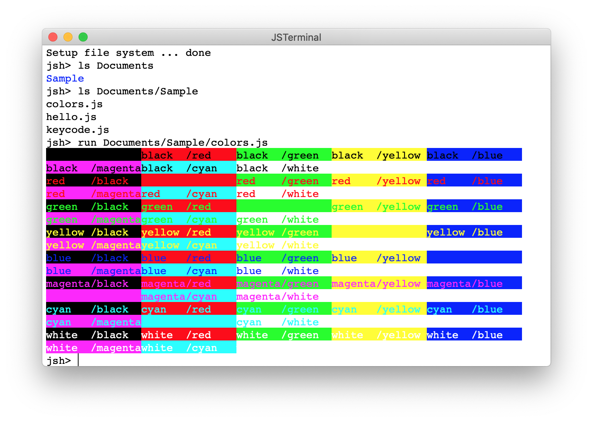

# JSTerminal: Rapid Application Development Environment

## Product goal 
The `JSTerminal` is rapid application development environment. It focus on *reducing the code*. The common function must be supported by the environment instead of the application developper.

The slogan is:


The goal of this application is different from another low code / no code tool. This application find the value of the code because it is most easy way to implement your ideas.

## Introduction
The *JSTerminal* is designed for *rapid application development*. 

This application has following features:
* _JavaScriptable_: You can write the application by JavaScript or TypeScript. The [standard library](https://github.com/steelwheels/KiwiScript/blob/master/KiwiLibrary/Document/Library.md) can be used. The JSTerminal does not support TypeScript, but it define the declaration file for TypeScript (`*.d.ts`) for builtin classes, functions and types.
* _GUI Designable_:  You can implement GUI application by the [Amber Programming Language](https://github.com/steelwheels/Amber/blob/master/Document/amber-language.md). The language has simular syntax to JavaScript, but it is used to declare structure of the components such as GUI. The [component library](https://github.com/steelwheels/KiwiCompnents/blob/master/Document/Library.md) contains the list of components. The GUI component is layouted by [autolayout](https://developer.apple.com/library/archive/documentation/UserExperience/Conceptual/AutolayoutPG/index.html). It means the designer does not have to arrange the layouts for multi size screens.
* _Automatic Storage Management_: The `data storage` system manages data loaded from (and stored to) file. See the document for [storage](https://github.com/steelwheels/KiwiScript/blob/master/KiwiLibrary/Document/Storage/Storage.md).
* Debug: The `jsh` shell program also support it for writting shell script. For more details, see [jsh language manual](https://github.com/steelwheels/JSTools/blob/master/Document/jsh-lang.md) and [jsh system manual](https://github.com/steelwheels/JSTools/blob/master/Document/jsh-sys.md). You can use [console](https://github.com/steelwheels/KiwiScript/blob/master/KiwiLibrary/Document/Class/Console.md) to dump the debug information. 

This product is open source software.
If you have any question or suggestions please send e-mail to [Steel Wheels Project](mailto:steel.wheels.project@gmail.com) or write issue to the [Github repository](https://github.com/steelwheels/JSTerminal).

This is a sample screen short of this application.


This is a sample GUI which is implemented on this application.

.

The soure code is:
````
top: VBox {
    label: Label {
	text: String "Hello, World !!"
    }
    ok_button: Button {
        title:  String "OK"
        pressed: Event() %{
		console.print("pressed: OK\n") ;
	    	leaveView(1) ;
        %}
    }
}
````

## Contents
* [Licence](#License): The license information
* Download: You can download this software from [App Store](https://apps.apple.com/jp/app/jsterminal/id1511276015?mt=12). 
* Target: The target machine
* [Setup](./Documents/Setup.md): After installation, the setup opetation is required.
* [Shell](./Documents/Shell.md): The `jsh` shell is supported for interactive operation.
* [Sample scripts](#Sample): This application has some sample applications.
* [How to start development](./Documents/HowToStart.md): The document helps you to start programming.
* [Programming](#Programming): Overview of the development  of application program.
* [Debugging](./Documents/Debug.md): How to debug by using terminal.
* [Desktop menu](https://github.com/steelwheels/JSTerminal/blob/master/Documents/DesktopMenu.md): The specification of the desktop menu
* [Bug & Restrictions](https://github.com/steelwheels/JSTerminal/blob/master/Documents/Restrictions.md): Known problems
* [Release History](#Release): Release history
* [Related documents](#Related): Links for references

## License
Copyright (C) 2020-2022 [Steel Wheels Project](https://github.com/steelwheels).
This software is distributed under [GNU GENERAL PUBLIC LICENSE Version 2](https://www.gnu.org/licenses/old-licenses/gpl-2.0.html) and the document is distributed under [GNU Free Documentation License](https://www.gnu.org/licenses/fdl-1.3.en.html).

## Target
* Target machine: macOS (The iPadOS will be supported in the future)
* Development environment: Xcode 11 or later
* Language for development: Swift and JavaScript

## Sample
You can use [run command](https://github.com/steelwheels/JSTools/blob/master/Document/builtins/run-man.md) to execute the script (Both JavaScript and Shell scripts are supported).

This is famous demo program for JavaScript.
````
jsh> cat Sample/hello.js
function main(args)
{
	console.print("Hello, world !!\n") ;
}

jsh> run Sample/hello.js
Hello, world !!
````

This is `jsh` version.
````
jsh> cat Sample/hello.jsh
> echo "hello" | tr [a-z] [A-Z]

jsh> run Sample/hello.jsh
HELLO
````

Following sample scriptes are distributed with the application.
|Script |Screenshot     |Description    |
|:--    |:--            |:--            |
|[colors.js](https://github.com/steelwheels/JSTerminal/blob/master/Resource/Sample/colors.js) | |Color on terminal and demonstrate color escape sequence. |
|[value-table-3.jspkg](https://github.com/steelwheels/JSTerminal/tree/master/Resource/Sample/value-table-3.jspkg) | |The table like spread sheet. |
|[graphics.jspkg](https://github.com/steelwheels/JSTerminal/tree/master/Resource/Sample/graphics.jspkg) | |Animation of Sin curve | 
|[turtle.jspkg](https://github.com/steelwheels/JSTerminal/tree/master/Resource/Sample/turtle.jspkg) |  |The Turtle class supports turtle graphics. | 
|[drawing.jspkg](https://github.com/steelwheels/JSTerminal/tree/master/Resource/Sample/drawing.jspkg) | |Vector graphics drawing tool|

## Programming
You can implement GUI by [Amber Programming Language](https://github.com/steelwheels/Amber/blob/master/Document/amber-language.md).
See [Component Library](https://github.com/steelwheels/KiwiCompnents/blob/master/Document/Library.md) to know about supported GUI components.

Here is the sample script written by Amber Programming Language.
````
top: VBox {
    ok_button: Button {
        title:  String "OK"
        pressed: Event() %{
            console.print("pressed: OK\n") ;
            leaveView(1) ;
        %}
    }
    cancel_button: Button {
        title:  String "Cancel"
        pressed: Event() %{
            console.print("pressed: Cancel\n") ;
            leaveView(0) ;
        %}
    }
}
````
Two buttons are defined in the script. When the "OK" button is pressed, the result of this script is "1". On the otherwise, when the "Cancel" button is pressed, the result value is "0".

The next GUI will be generated by the above script:


## Release history
|Version        |Date		|Description            |
|:--            |:--		|:--                    |
|1.0   	|2020/05/05	|Initial Version        |
|1.1	|2020/05/28	|Update to support [Curses Class](https://github.com/steelwheels/KiwiScript/blob/master/KiwiLibrary/Document/Class/Curses.md). |
|1.2	|2020/06/28	|Support [JavaScript Package](https://github.com/steelwheels/JSTools/blob/master/Document/jspkg.md), Support command and file name completion by TAB key. |
|1.3	|2020/07/13 |Support `.jshrc` file to setup environment at the boot time. Fix bugs about terminal emulation. |
|1.4	|2020/08/29 |Support AppleEvents to be controlled by AppleScript |
|1.5.4	|2021/01/03 |Support [Amber Programming Language](https://github.com/steelwheels/Amber/blob/master/Document/amber-language.md) for GUI design |
|1.6   |2021/02/02 |Support [Table component](https://github.com/steelwheels/KiwiCompnents/blob/master/Document/Components/Table.md) and [2D Graphics component](https://github.com/steelwheels/KiwiCompnents/blob/master/Document/Components/Graphics2D.md). |
|1.7.1 |2021/03/20  |
|1.8   |2021/05/??  |Update Tavble view compont support. |
|1.9   |2021/10/10  |Suport contact database access |

## Related document
* [Amber Programming Language](https://github.com/steelwheels/Amber/blob/master/Document/amber-language.md): The specification of this language. See [sample scripts](./Documents/AmberProgramming.md).
* [Kiwi Components](https://github.com/steelwheels/KiwiCompnents/blob/master/Document/Library.md): List of all components
* [Kiwi Standard Library](https://github.com/steelwheels/KiwiScript/blob/master/KiwiLibrary/Document/Library.md): The standard library for JavaScript programming.
* [Kiwi Component Library](https://github.com/steelwheels/KiwiCompnents/blob/master/Document/Library.md): The classes/functions to operate GUI component.
* Sample Scripts: [sample game script](./Documents/Games/Games.md), [sample GUI script](Sample/GUIs.md)
* [Steel Wheels Project](http://steelwheels.github.io): Developer's web site.
